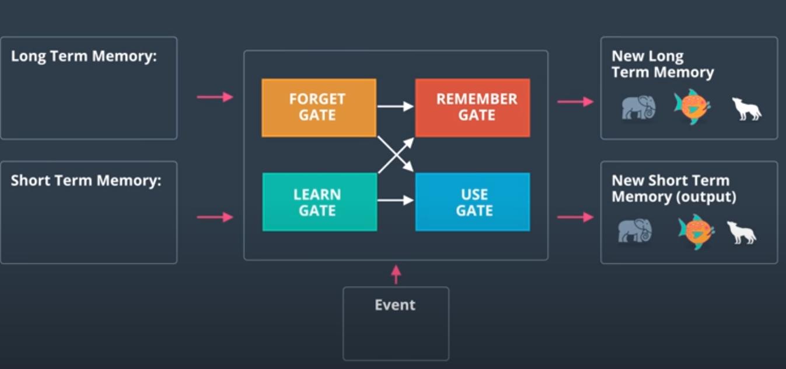
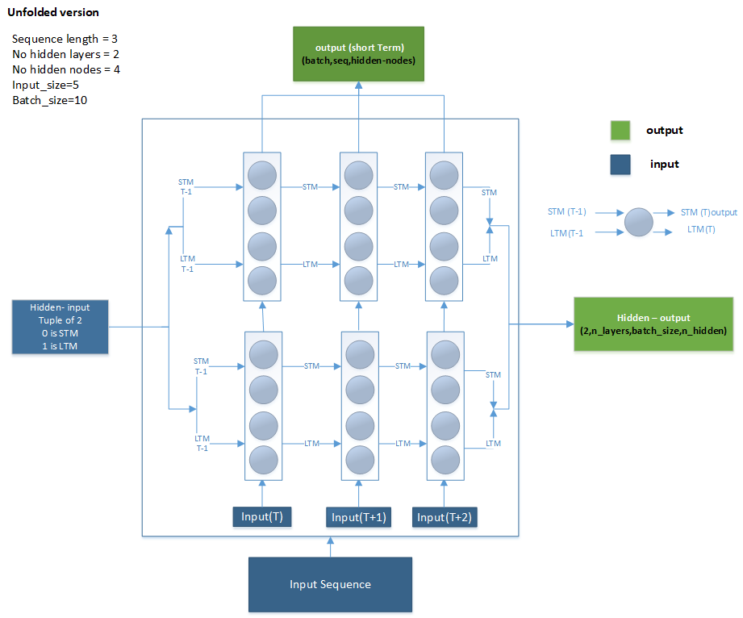

# introduction  
  

- this section will explain how to implement the Long Term Short term Memory (LSTM) in Pytorch  
- the next picture is picture of un-folded version of LSTM of two layers , 4 hidden nodes and sequence length =3  


# LSTM input
- LSTM takes in the input (in) and hidden.
- input has shape of (batch_size , sequence_length  , Input size)
- hidden is a tuple of two  
  - first one is the short-term-output (t-1) which is the output for the last sequence at time t-1 has shape of (n_layers,batch_size,n_hidden) in this case `(2,10,4)`  
  - second is the long-term-output at (t-1) has shape of (n_layers,batch_size,n_hidden) in this case `(2,10,4)`  
# LSTM output
  - output --> which is the output of the given n sequences has shape of (n_batches,n_sequences,n_hidden)
  - hidden --> tuple (STM output , LTM output)
    - first one is the short-term-output  which is the output for the last sequence at time  has shape of (n_layers,batch_size,n_hidden) in this case `(2,10,4)`  
    - second is the long-term-output , has shape of (n_layers,batch_size,n_hidden) in this case `(2,10,4)`
# Code
## Model
- this is example of a model has LSTM only
```python
import torch.nn as nn

class MyModel(nn.Module):
    def __init__(self,input_dim,n_layers,n_hidden):
        super().__init__()
        self.lstm = nn.LSTM(input_size=input_dim, hidden_size=n_hidden, num_layers=n_layers, dropout=0.3, batch_first=True)
        self.n_layers,self.n_hidden=n_layers,n_hidden

    def forward(self, x, hidden):
        out, hidden = self.lstm(x, hidden)

        return out,hidden


    def init_hidden(self, batch_size,train_on_gpu):
        ''' Initializes hidden state '''
        # Create two new tensors with sizes n_layers x batch_size x n_hidden,
        # tensor.new --> method that creates a new tensor with the same type and device of this tensor
        # initialized to zero, for hidden state and cell state of LSTM
        weight = next(self.parameters()).data

        if train_on_gpu:
            hidden = (weight.new(self.n_layers, batch_size, self.n_hidden).zero_().cuda(),
                      weight.new(self.n_layers, batch_size, self.n_hidden).zero_().cuda())
        else:
            hidden = (weight.new(self.n_layers, batch_size, self.n_hidden).zero_(),
                      weight.new(self.n_layers, batch_size, self.n_hidden).zero_())

        return hidden
```
```python
batch_size=10
seq_size=3
input_size=5
n_layers=2
n_hidden=4
model=MyModel(input_dim=input_size,n_hidden=n_hidden,n_layers=n_layers)
```
## Feed forward
```python
# generating random input sequence
rand_x=torch.rand(batch_size*seq_size*input_size).view(batch_size,seq_size,input_size)
print(f"input shape {rand_x.shape}")

# get the hidden input at t0 which is zeros
hidden_0=model.init_hidden(batch_size,False)
out,hidden=model(rand_x,hidden_0)

print(f"hidden shape {type(hidden)} size {len(hidden)}")
print(f"output of STM shape{hidden[0].shape}")
print(f"output of LTM shape{hidden[1].shape}")
print(f"output shape {out.shape}")
```
- output
```
input shape torch.Size([10, 3, 5])
hidden shape <class 'tuple'> size 2
output of STM shapetorch.Size([2, 10, 4])
output of LTM shapetorch.Size([2, 10, 4])
output shape torch.Size([10, 3, 4])
```
- showing that the output of the last sequence = the output of the short term memory of the last layer
```python
last_seq_out=out[:,2,:]
print(f"last sequence out shape {last_seq_out.shape}")

stm_out=hidden[0]
# second layer which is the last layer
print(f"STM second layer out shape {stm_out[1].shape}")

print(torch.equal(stm_out[1],last_seq_out))
```
- output
```
last sequence out shape torch.Size([10, 4])
STM second layer out shape torch.Size([10, 4])
True
```