# torch matrix operations
- matrix multiplication
``` python
  ### Generate some data
torch.manual_seed(7) # Set the random seed so things are predictable
# Features are 3 random normal variables
features = torch.randn((1, 5))
# True weights for our data, random normal variables again
weights = torch.randn_like(features)
# and a true bias term
bias = torch.randn((1, 1))

## Calculate the output of this network using the weights and bias tensors
x=torch.mm(features,weights.view(5,1))
y=torch.sum(x)
output=activation(y)
output=activation(torch.mm(features,weights.view(5,1)))
```
## convert from numpy to torch and back
- from numpy to torch `b=torch.from_numpy(a)`
- from torch to numpy `b.numpy()`
---
# Building networks with PyTorch
## building networks with pytorch using nn class from pytorch
```python
from torch import nn
import torch.nn.functional as F
class Network(nn.Module):
    def __init__(self):
        super().__init__()
        # Inputs to hidden layer linear transformation
        self.hidden = nn.Linear(784, 256)
        # Output layer, 10 units - one for each digit
        self.output = nn.Linear(256, 10)
        
        # Define sigmoid activation and softmax output 
        self.sigmoid = nn.Sigmoid()
        self.softmax = nn.Softmax(dim=1)
        
    def forward(self, x):
        # Pass the input tensor through each of our operations
        x = self.hidden(x)
        x = self.sigmoid(x)
        x = self.output(x)
        x = self.softmax(x)
        
        return x
```
- note `softmax(dim=1)` to calculate the softmax among columns where softmax calculated  for each row among its columns
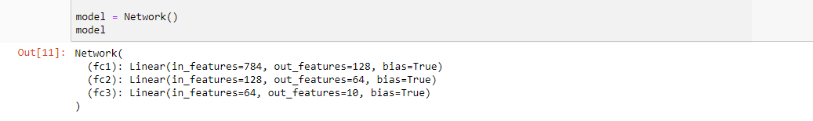

- Linear layer `fc1=nn.Linear(input_size, output_size,bias=True)`
- to access layer weights and bias `fc1.weight` , `fc1.bias` 
## activation functions
- neural networks is a universal function approximators for any problem that could map any input to preferred output. most of the problems solved with a non-linear functions so we introduce non-linearity to the networks by applying activation functions
- 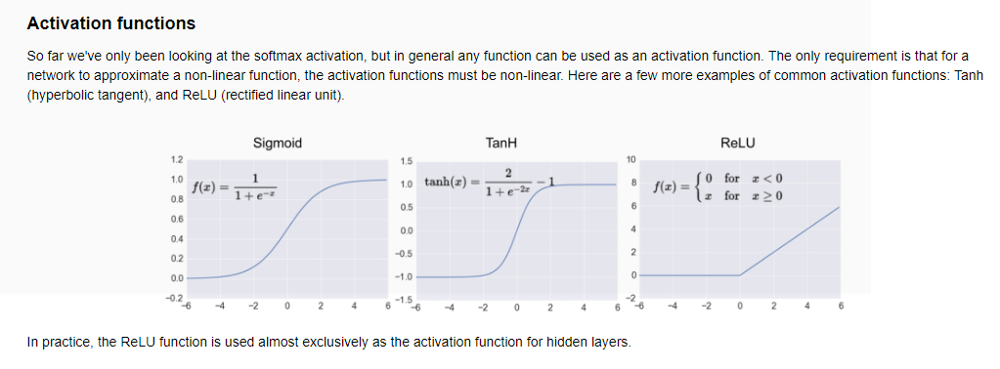 

### Relu activation function

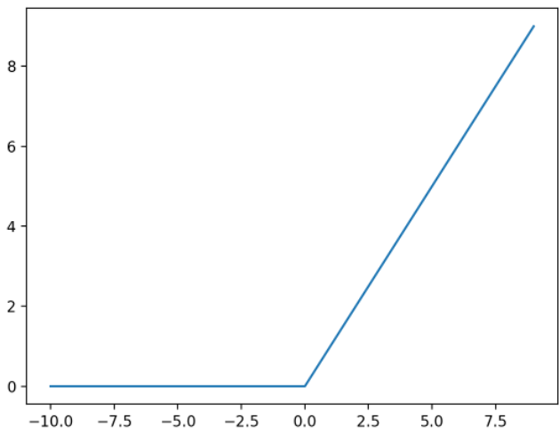

- Rectified Linear Unit is an activation function used in nearly all modern neural network architectures. It’s defined as max(0, x).
- At first glance it might look that the function is not that much of a non-linearity, but I will show that you can approximate any function with it.
- with more than one relu we can approximate any curvature   
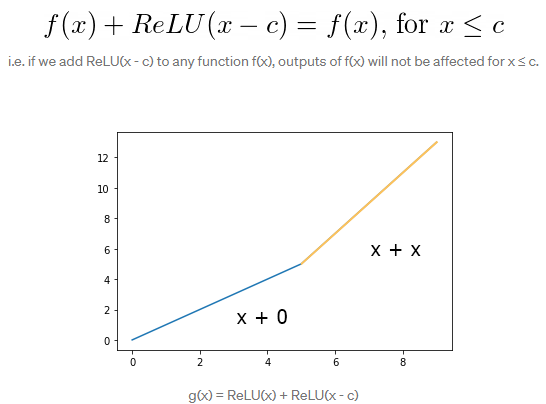

- f(x)=x , relu(x-c) when x<=c it will be equal 0 , when x>c relu of x will be x then g(x)= f(x)+RelU(x-c) will be equal 2x after x>c
- for more than one element  
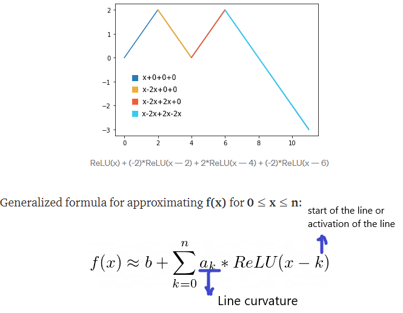

```python
    from torch import nn
    self.sigmoid = nn.Sigmoid()
    self.softmax = nn.Softmax(dim=1)
 ```
- another method
```python
import torch.nn.functional as F

class Network(nn.Module):
    def __init__(self):
        super().__init__()
        # Inputs to hidden layer linear transformation
        self.hidden = nn.Linear(784, 256)
        # Output layer, 10 units - one for each digit
        self.output = nn.Linear(256, 10)
        
    def forward(self, x):
        # Hidden layer with sigmoid activation
        x = F.sigmoid(self.hidden(x))
        # Output layer with softmax activation
        x = F.softmax(self.output(x), dim=1)
        
        return x
    
```

### Initializing weights and biases

The weights and such are automatically initialized for you, but it's possible to customize how they are initialized. 
The weights and biases are tensors attached to the layer you defined, you can get them with `model.fc1.weight` for instance.
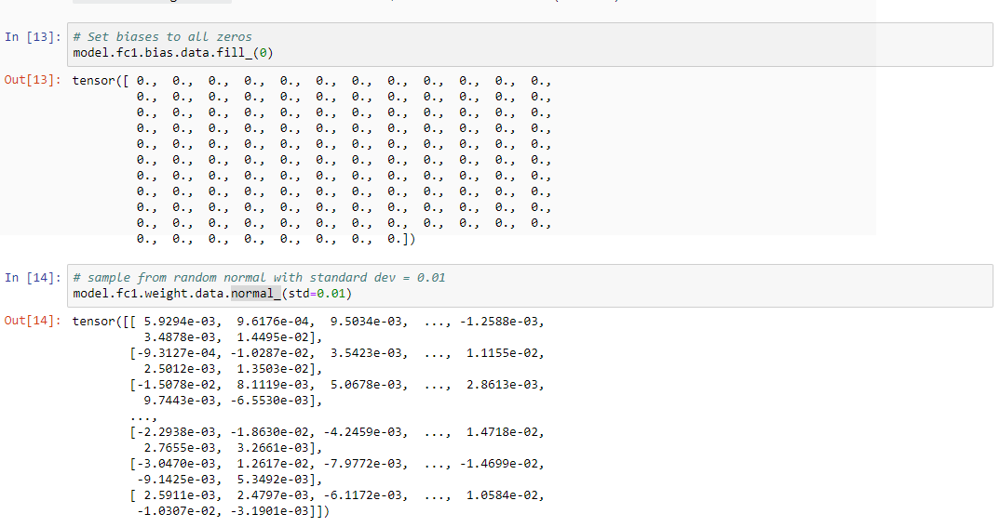
## build networks with Using nn.Sequential
### Using `nn.Sequential`

PyTorch provides a convenient way to build networks like this where a tensor is passed sequentially through operations, `nn.Sequential` ([documentation](https://pytorch.org/docs/master/nn.html#torch.nn.Sequential)).  
Using this to build the equivalent network:
```python
# Hyperparameters for our network
input_size = 784
hidden_sizes = [128, 64]
output_size = 10

# Build a feed-forward network
model = nn.Sequential(nn.Linear(input_size, hidden_sizes[0]),
                      nn.ReLU(),
                      nn.Linear(hidden_sizes[0], hidden_sizes[1]),
                      nn.ReLU(),
                      nn.Linear(hidden_sizes[1], output_size),
                      nn.Softmax(dim=1))
print(model)

# Forward pass through the network and display output
images, labels = next(iter(trainloader))
images.resize_(images.shape[0], 1, 784)
ps = model.forward(images[0,:])
helper.view_classify(images[0].view(1, 28, 28), ps)
```

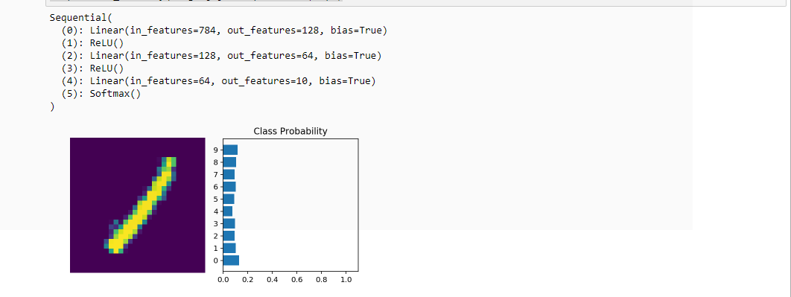
### access layers in nn. Sequential and access weights 
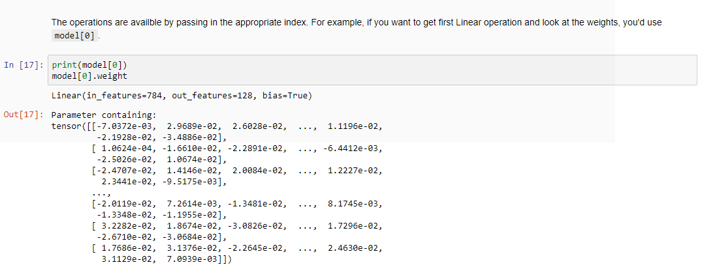

### giving names for  layers 
- You can also pass in an OrderedDict to name the individual layers and operations, instead of using incremental integers. Note that dictionary keys must be unique, so each operation must have a different name.
```python
from collections import OrderedDict
model = nn.Sequential(OrderedDict([
                      ('fc1', nn.Linear(input_size, hidden_sizes[0])),
                      ('relu1', nn.ReLU()),
                      ('fc2', nn.Linear(hidden_sizes[0], hidden_sizes[1])),
                      ('relu2', nn.ReLU()),
                      ('output', nn.Linear(hidden_sizes[1], output_size)),
                      ('softmax', nn.Softmax(dim=1))]))
```
-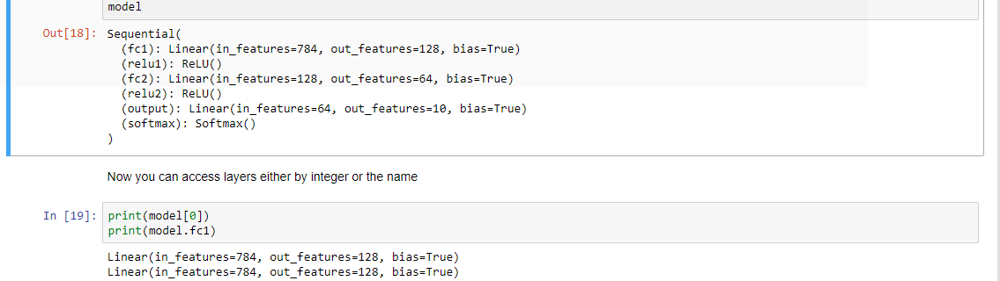
---
---
# Autograd in pytorch
- autograd calculates the derivative for weights by tracking all mathematical operation done to them in a tree
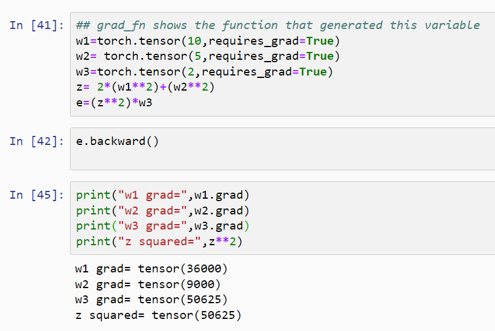  

- `e.backward()` calculates derivative of e with respect all independent variables that used to calculate e
  - w1 , w2 , w3  are independent variables , we must set `requires_grad=True` to trace mathematical operations done on the variable
  - `tensor.grad` outputs the grad calculated by e.backward() 
  - note: if recalculate the past operations again and call e.backward() new grads of w1,w2,w3 will be accumulated on the past grads
    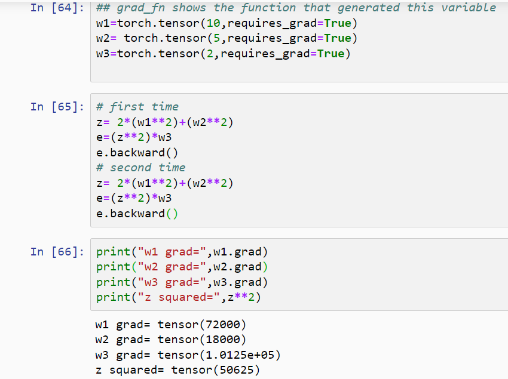  
  - so after each forward step we need to clear grads
- to turn of the track of math operations to calculate grad to make the computations faster if we don't need grad calculation
   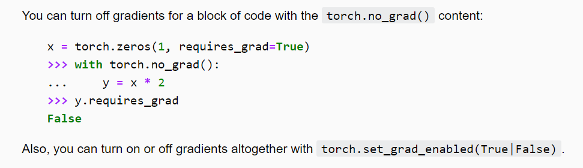  
  - you can set requires_grad to all variables to `False` or use with torch.no_grad(): in all operations


# Training Neural Networks
## Data loading
- dataset is MINST data --> images for handwritten digits and we need to classify the given images from 0 to 10 (which number)
```python
import torch
from torch import nn
import torch.nn.functional as F
from torchvision import datasets, transforms

# Define a transform to normalize the data
transform = transforms.Compose([transforms.ToTensor(),
                                transforms.Normalize((0.5, 0.5, 0.5), (0.5, 0.5, 0.5)),
                              ])
# Download and load the training data
trainset = datasets.MNIST('~/.pytorch/MNIST_data/', download=True, train=True, transform=transform)
trainloader = torch.utils.data.DataLoader(trainset, batch_size=64, shuffle=True)
```


training neural networks needs:
1. calculate loss function
2. do backpropagation to 
   - calculate dE/dWi (derivative of weights with respect to error function)
   - calculate dE/dbi (derivative of bias with respect to error function)
   - using auto grad in pytorch to update weights and bias
3. update weights and bias using optimizers
## 1-Calculate loss function and loss function types
- we calculate the loss with PyTorch. Through the nn module, PyTorch provides losses such as the cross-entropy loss (nn.CrossEntropyLoss). You'll usually see the loss assigned to criterion.
### loss function types and when to use each one of them
- 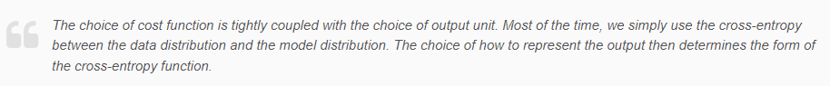
- 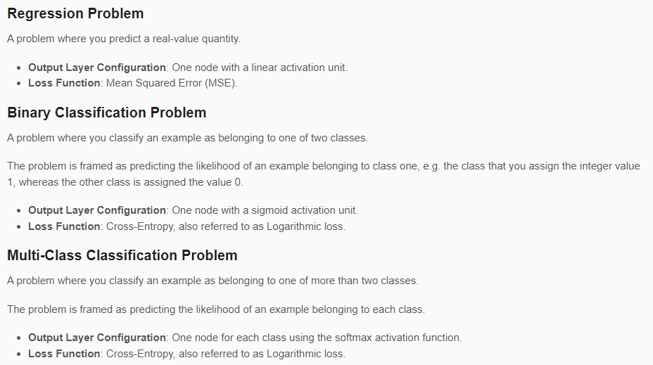
#### cross entropy
- cross Entropy in multiclass using `nn.CrossEntropyLoss(predicted,actual)` where actual is the class index
- it combines softmax and negative log loss , expected input is the logists without activation layer 

```python
# Build a feed-forward network
model = nn.Sequential(nn.Linear(784, 128),
                      nn.ReLU(),
                      nn.Linear(128, 64),
                      nn.ReLU(),
                      nn.Linear(64, 10)) #<------- output without activation function

# Define the loss
criterion = nn.CrossEntropyLoss() #<---------- softmax + negative log loss

# Get our data
images, labels = next(iter(trainloader))
# Flatten images
images = images.view(images.shape[0], -1)

# Forward pass, get our logits
logits = model(images)
# Calculate the loss with the logits and the labels
loss = criterion(logits, labels)
print(labels.size())
print(loss)
```
- cross Entropy using combination of `nn.LogSoftmax` or `F.log_softmax` and `nn.NLLLoss`
  - we can add `nn.LogSoftmax` layer then use `nn.NLLLoss` which calculates the negative of the output nn.LogSoftmax
  - this way is better because when we need to calculate the output of the network to use it in prediction we can take e to the output which is torch.exp(log(Softmax(x))) = Softmax(x)
```python
# TODO: Build a feed-forward network
model = nn.Sequential(nn.Linear(784, 128),
                      nn.ReLU(),
                      nn.Linear(128, 64),
                      nn.ReLU(),
                      nn.Linear(64, 10),
                     nn.LogSoftmax(dim=1)) #<------------

# TODO: Define the loss
criterion = nn.NLLLoss() #<----------------

### Run this to check your work
# Get our data
images, labels = next(iter(trainloader))
# Flatten images
images = images.view(images.shape[0], -1)
print(images.shape)

# Forward pass, get our logits
logits = model(images)
# Calculate the loss with the logits and the labels
loss = criterion(logits, labels)

print(loss)
```
#### Mean squared error
- takes input of linear function without activation or use Relu
```python
mse = nn.MSELoss()

# compute the loss (mean squared error)
output = mse(input, target)
```
##2- do backpropagation to the loss
- `loss = criterion(logits, labels)` loss --> is the loss tensor calculated after feedforward
- use `loss.backward()` to calculate grad to all independent variables that calculates the loss (weights)
    
- model[0].weight --> is the weight tensor of layer0 before `loss.backward()` grad is none after loss.backward() it will have the d(loss)/d(model[0].weight) 
- now we need to update the weights
## update weights and bias using optimizers
- optimizers used to update  weight and bias after calculating the error function and do backpropagation to decrease the cost of the error function
### optimizer types

#### 1-gradient-decent
- gradient decent updates the weight of the layers after passing on the whole data and summing the gradient for each weight and bias after each iteration then change the weight with the sum of gradients multiplied by learning rate
- loss is accumulated throw the whole epoch, and we take the mean of it as the loss after the epoch
  - 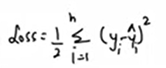
- in gradient decent we could feed the whole data one time by matrix multiplication and calculate derivatives also by matrix multiplications for each row and sum them and add the sum to the weights instead of doing n_records iterations 
```
    for _ in epochs
        delta_wi_sum=0
        loss_sum=0
        for row in dataset
            calculate delta_wi
            calulate loss
            delta_wi_sum+= delta_wi
            loss_sum+=loss
        epoch_loss= loss_sum/no_of_rows
        wi-= delta_wi_sum*learining_rate
```
if data fit into memory, so we can use the advantages of gpus and multiprocessing for speeding up the training and practically this method is done the past code is for illustration
```
n--> no of records
for _ in epochs:
    output=feed_foward(data_matrix)
    calculate delta_wi_tensor for each record dim for each matrix (nxmxn)
    wi-= delta_wi_tensor.sum()*learning_rate
    loss_tensor=1/2(yi-pi)^2  --> (n) dim tensor
    epoch_loss=loss_tensor.sum()/n
```
- uses alot memory for feed-forward rows_matrix and also multiplications to calculate derivatives
##### advantages
##### disadvantages

#### stochastic-Gradient-Decent (SGD)
- feeds the data row by row and calculate the loss and do backpropagation and update weights for each row also
- if we have 1m records, and we do 20 epochs then we will have 20 million iteration
- stochastic --> because it takes a little noisy path to the global minima according to small portion of the data not the whole view
```
    for _ in epochs
        for row in dataset
            feed_forwad
            calculate delta_wi
            calulate loss
            wi-= delta_wi*learining_rate
```
##### advantages
- less memory usage
##### disadvantages
- alot of iterations
- alot of noise as some rows are distracting noise rows will make us go away from the global minimum

#### mini-batch-SGD
- instead of taking the whole data in one iteration (one batch) or taking row by row we will take for each iteration batch of data with size b
- if we have 10k records with batch size 100, each iteration we will take 100 records and feed them to the network and calculate error and do backpropagation and update the weights now we have 100 iteration instead of 10000 
- we have now 100 forward and backward propagation
```
    for _ in epochs
        for batch in dataset_batches
            feed_forwad(batch)
            calculate delta_wi_tensor for batch
            delta_wi_sum=delta_wi_tensor.sum()
            calulate loss for batch in loss_tensor
            loss=loss_tensor/batch_size
            wi-= delta_wi_sum*learining_rate
```
mini-batch SGD vs gradient decent
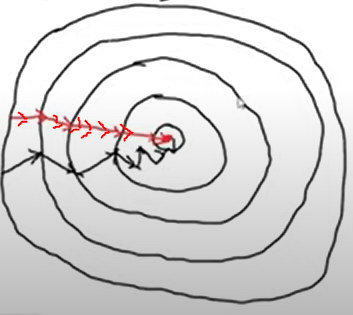  
red --> mini-batch SGD , medium noisy steps  
black--> batch gradient decent , low noise steps

##### advantages
- less noise as we take batch of data to update the weight not one by one if one row has noise it won't affect us much
- medium memory resources 
##### disadvantages

#### mini-batch SGD with momentum
- we will try to smooth the noisy steps we take to the global minima
- difference is just in the way of updating weights to make the smooth the noise by instead of moving to the direction of new delta-wi we are moving in the direction between delta_wi and delta_wi-1
- beta variable is how me prefer the last step over current step, if b=0.95 then equation will be 0.95*d_wi-1 + 0.05*d_wi  
  <br><br>
- v_d_wt , initially v_d_wt=0   
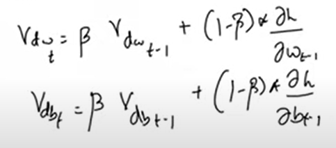 <br><br>
- weight-update formula
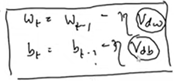  

```
# t --> time
for _ in epoch
    v_dw_t=0
    beta=0.5
    for batch in data_batches
        feed_forwad(batch)
        calculate delta_wi_tensor for batch
        delta_wi_sum=delta_wi_tensor.sum()
        v_dw_t=beta*v_dw_t + (1-beta) * delta_wi_sum
        calulate loss for batch in loss_tensor
        loss=loss_tensor/batch_size
        wi-= v_dw_t*learining_rate
```
#### adaptive gradient decent (AdA)
- all past optimizer algorithms uses fixed learning rate
- in ada optimizer the learning rate changes by no of iterations starting with high learning rate and when it comes closer to the min point the learning rate decrease to prevent oscillation on the min point  
- networks optimization could lead to different sensitivity on each dimension. The learning rate could be too small in some dimension and could be too large in another dimension.
- This algorithm adaptively scaled the learning rate for each dimension
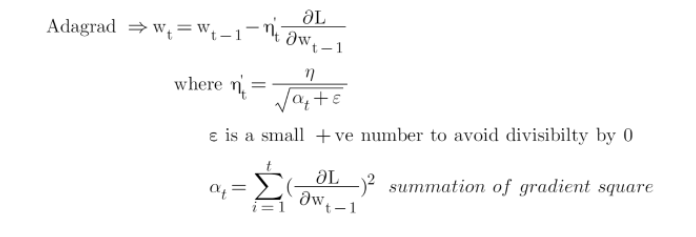    
- learning rate is calculated from the initial learning rate divided by summation of gradient of weight square all under square root this will result a matrix has learning rate for each weight
- in neural networks learning we need manualy to decrease the learning rate while training the model , this algorithm decreases it by time
##### advantages
- uses a learning rate for each weight
- learning rate automatically decreases by time
##### disadvantages
- sometimes learning rate decreases and become approximately zero and the network stops learning

#### Adadelta And RMSprop

- same like ada but adding (1-b) and b to the equation to multiply new gradient by small number before adding it to the sum to avoid sum explosion and vanishing the learning rate
- 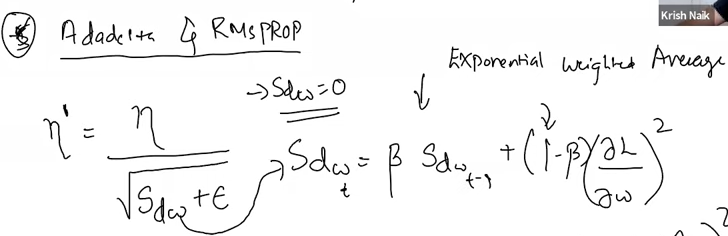
- 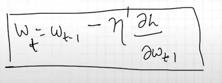
- example
  - set b to 0.95 
  - 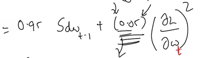
  - now we won't divide the learning rate by big number

#### Adam optimizer (adaptive moment estimation)
- combines momentum SGD momentum and RMS prop
- smooth movement to min and adaptive learning rate
- it is the most used algorithm
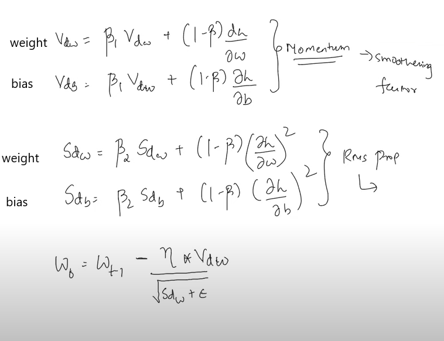  


#### optimizer code
`optim.Adagrad(model.parameters(),lr=0.01) adagrad`
`optim.Adam(optim.Adam(params, lr=0.001, betas=(0.9, 0.999)) #adam`
`optimizer=optim.SGD(params, lr=<required parameter>, momentum=0)  ` stochastic gradient with momentum if momentum is specified ex momentum= 0.9

```
from torch import optim
optimizer=optim.SGD(model.parameters(),lr=0.01) #stocastic gradient
optimizer=optim.Adam(model.parameters(),lr=0.01) #adam g


for e in epochs
    for data_batch in data_batches
    optimizer.zero_grad() # to clear weights.grad values we don't do that grad will be accumlated from past feed-forward
    feed-forward()
    loss.backward() #calculate grad
    optimizer.step() #update wieghts with thier grad variable

```
## full example
```python
model = nn.Sequential(nn.Linear(784, 128),
                      nn.ReLU(),
                      nn.Linear(128, 64),
                      nn.ReLU(),
                      nn.Linear(64, 10),
                      nn.LogSoftmax(dim=1))

criterion = nn.NLLLoss()
optimizer = optim.SGD(model.parameters(), lr=0.003)

epochs = 5
for e in range(epochs):
    running_loss = 0
    for images, labels in trainloader:
        optimizer.zero_grad()
        # Flatten MNIST images into a 784 long vector
        images = images.view(images.shape[0], 784)
        # TODO: Training pass
        output=model(images)
        
        loss = criterion(output, labels)
        loss.backward()
        running_loss += loss.item()
        optimizer.step()
    else:
        print(f"Training loss: {running_loss/len(trainloader)}")
```