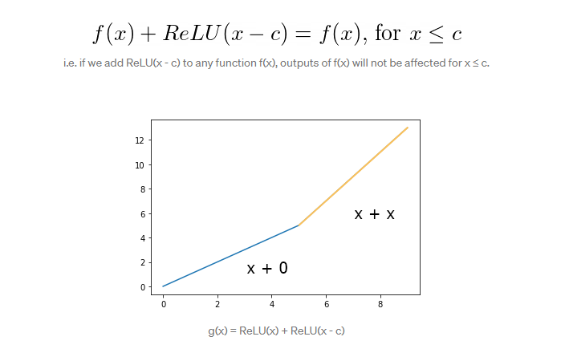

#torch matrix operations
- matrix multiplication
``` python
  ### Generate some data
torch.manual_seed(7) # Set the random seed so things are predictable
# Features are 3 random normal variables
features = torch.randn((1, 5))
# True weights for our data, random normal variables again
weights = torch.randn_like(features)
# and a true bias term
bias = torch.randn((1, 1))

## Calculate the output of this network using the weights and bias tensors
x=torch.mm(features,weights.view(5,1))
y=torch.sum(x)
output=activation(y)
output=activation(torch.mm(features,weights.view(5,1)))
```
## convert from numpy to torch and back
- from numpy to torch `b=torch.from_numpy(a)`
- from torch to numpy `b.numpy()`
---
# Building networks with PyTorch
## building networks with pytorch using nn class from pytorch
```python
from torch import nn
import torch.nn.functional as F
class Network(nn.Module):
    def __init__(self):
        super().__init__()
        # Inputs to hidden layer linear transformation
        self.hidden = nn.Linear(784, 256)
        # Output layer, 10 units - one for each digit
        self.output = nn.Linear(256, 10)
        
        # Define sigmoid activation and softmax output 
        self.sigmoid = nn.Sigmoid()
        self.softmax = nn.Softmax(dim=1)
        
    def forward(self, x):
        # Pass the input tensor through each of our operations
        x = self.hidden(x)
        x = self.sigmoid(x)
        x = self.output(x)
        x = self.softmax(x)
        
        return x
```
- note `softmax(dim=1)` to calculate the softmax among columns where softmax calculated  for each row among its columns


- Linear layer `fc1=nn.Linear(input_size, output_size,bias=True)`
- to access layer weights and bias `fc1.weight` , `fc1.bias` 
## activation functions
- 
```python
    from torch import nn
    self.sigmoid = nn.Sigmoid()
    self.softmax = nn.Softmax(dim=1)
 ```
- another method
```python
import torch.nn.functional as F

class Network(nn.Module):
    def __init__(self):
        super().__init__()
        # Inputs to hidden layer linear transformation
        self.hidden = nn.Linear(784, 256)
        # Output layer, 10 units - one for each digit
        self.output = nn.Linear(256, 10)
        
    def forward(self, x):
        # Hidden layer with sigmoid activation
        x = F.sigmoid(self.hidden(x))
        # Output layer with softmax activation
        x = F.softmax(self.output(x), dim=1)
        
        return x
    
```

### Initializing weights and biases

The weights and such are automatically initialized for you, but it's possible to customize how they are initialized. 
The weights and biases are tensors attached to the layer you defined, you can get them with `model.fc1.weight` for instance.

## build networks with Using nn.Sequential
### Using `nn.Sequential`

PyTorch provides a convenient way to build networks like this where a tensor is passed sequentially through operations, `nn.Sequential` ([documentation](https://pytorch.org/docs/master/nn.html#torch.nn.Sequential)).  
Using this to build the equivalent network:
```python
# Hyperparameters for our network
input_size = 784
hidden_sizes = [128, 64]
output_size = 10

# Build a feed-forward network
model = nn.Sequential(nn.Linear(input_size, hidden_sizes[0]),
                      nn.ReLU(),
                      nn.Linear(hidden_sizes[0], hidden_sizes[1]),
                      nn.ReLU(),
                      nn.Linear(hidden_sizes[1], output_size),
                      nn.Softmax(dim=1))
print(model)

# Forward pass through the network and display output
images, labels = next(iter(trainloader))
images.resize_(images.shape[0], 1, 784)
ps = model.forward(images[0,:])
helper.view_classify(images[0].view(1, 28, 28), ps)
```


### access layers in nn. Sequential and access weights 


### giving names for  layers 
- You can also pass in an OrderedDict to name the individual layers and operations, instead of using incremental integers. Note that dictionary keys must be unique, so each operation must have a different name.
```python
from collections import OrderedDict
model = nn.Sequential(OrderedDict([
                      ('fc1', nn.Linear(input_size, hidden_sizes[0])),
                      ('relu1', nn.ReLU()),
                      ('fc2', nn.Linear(hidden_sizes[0], hidden_sizes[1])),
                      ('relu2', nn.ReLU()),
                      ('output', nn.Linear(hidden_sizes[1], output_size)),
                      ('softmax', nn.Softmax(dim=1))]))
```
-
---
---
# Autograd in pytorch

# Training Neural Networks
## Data loading
- dataset is MINST data --> images for handwritten digits and we need to classify the given images from 0 to 10 (which number)
```python
import torch
from torch import nn
import torch.nn.functional as F
from torchvision import datasets, transforms

# Define a transform to normalize the data
transform = transforms.Compose([transforms.ToTensor(),
                                transforms.Normalize((0.5, 0.5, 0.5), (0.5, 0.5, 0.5)),
                              ])
# Download and load the training data
trainset = datasets.MNIST('~/.pytorch/MNIST_data/', download=True, train=True, transform=transform)
trainloader = torch.utils.data.DataLoader(trainset, batch_size=64, shuffle=True)


```


training neural networks needs:
1. calculate loss function
2. do backpropagation to 
   - calculate dE/dWi (derivative of weights with respect to error function)
   - calculate dE/dbi (derivative of bias with respect to error function)
   - using auto grad in pytorch to update weights and bias
3. update weights and bias

## 1-Calculate loss function and loss function types
- we calculate the loss with PyTorch. Through the nn module, PyTorch provides losses such as the cross-entropy loss (nn.CrossEntropyLoss). You'll usually see the loss assigned to criterion.
### loss function types and when to use each one of them
- 
- 
#### cross entropy
- cross Entropy in multiclass using `nn.CrossEntropyLoss(predicted,actual)` where actual is the class index
- it combines softmax and negative log loss , expected input is the logists without activation layer 

```python
# Build a feed-forward network
model = nn.Sequential(nn.Linear(784, 128),
                      nn.ReLU(),
                      nn.Linear(128, 64),
                      nn.ReLU(),
                      nn.Linear(64, 10)) #<------- output without activation function

# Define the loss
criterion = nn.CrossEntropyLoss() #<---------- softmax + negative log loss

# Get our data
images, labels = next(iter(trainloader))
# Flatten images
images = images.view(images.shape[0], -1)

# Forward pass, get our logits
logits = model(images)
# Calculate the loss with the logits and the labels
loss = criterion(logits, labels)
print(labels.size())
print(loss)
```
- cross Entropy using combination of `nn.LogSoftmax` or `F.log_softmax` and `nn.NLLLoss`
  - we can add `nn.LogSoftmax` layer then use `nn.NLLLoss` which calculates the negative of the output nn.LogSoftmax
  - this way is better because when we need to calculate the output of the network to use it in prediction we can take e to the output which is torch.exp(log(Softmax(x))) = Softmax(x)
```python
# TODO: Build a feed-forward network
model = nn.Sequential(nn.Linear(784, 128),
                      nn.ReLU(),
                      nn.Linear(128, 64),
                      nn.ReLU(),
                      nn.Linear(64, 10),
                     nn.LogSoftmax(dim=1)) #<------------

# TODO: Define the loss
criterion = nn.NLLLoss() #<----------------

### Run this to check your work
# Get our data
images, labels = next(iter(trainloader))
# Flatten images
images = images.view(images.shape[0], -1)
print(images.shape)

# Forward pass, get our logits
logits = model(images)
# Calculate the loss with the logits and the labels
loss = criterion(logits, labels)

print(loss)
```
#### Mean squared error
- takes input of linear function without activation or use Relu
```python
mse = nn.MSELoss()

# compute the loss (mean squared error)
output = mse(input, target)
```